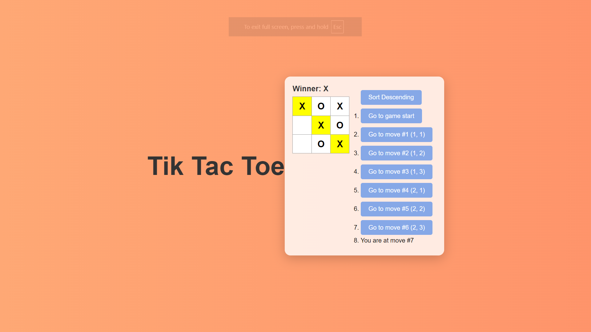

This is a [Next.js](https://nextjs.org) project bootstrapped with [`create-next-app`](https://nextjs.org/docs/app/api-reference/cli/create-next-app).

# [this project uses typescript but the app.js contetn is written using jsx]
this project is an implementation on the react [tic-tac-toe tutorial](https://react.dev/learn/tutorial-tic-tac-toe)
with added features.

note : the project is files are organized in typescript but the code uses jsx

### [1,For the current move only, show “You are at move #…” instead of a button.]
### [2,Rewrite Board to use two loops to make the squares instead of hardcoding them.]
### [3,Add a toggle button that lets you sort the moves in either ascending or descending order.]
### [4,When someone wins, highlight the three squares that caused the win (and when no one wins, display a message about the result being a  draw).]
### [5.Display the location for each move in the format (row, col) in the move history list.]

## [Desktop view of the site]


## Getting Started with react 

First, run the development server:

```bash
npm run dev
# or
yarn dev
# or
pnpm dev
# or
bun dev
```

Open [http://localhost:3000](http://localhost:3000) with your browser to see the result.

You can start editing the page by modifying `app/page.tsx`. The page auto-updates as you edit the file.

This project uses [`next/font`](https://nextjs.org/docs/app/building-your-application/optimizing/fonts) to automatically optimize and load [Geist](https://vercel.com/font), a new font family for Vercel.

## Learn More

To learn more about Next.js, take a look at the following resources:

- [Next.js Documentation](https://nextjs.org/docs) - learn about Next.js features and API.
- [Learn Next.js](https://nextjs.org/learn) - an interactive Next.js tutorial.

You can check out [the Next.js GitHub repository](https://github.com/vercel/next.js) - your feedback and contributions are welcome!

## Deploy on Vercel

The easiest way to deploy your Next.js app is to use the [Vercel Platform](https://vercel.com/new?utm_medium=default-template&filter=next.js&utm_source=create-next-app&utm_campaign=create-next-app-readme) from the creators of Next.js.

Check out our [Next.js deployment documentation](https://nextjs.org/docs/app/building-your-application/deploying) for more details.
